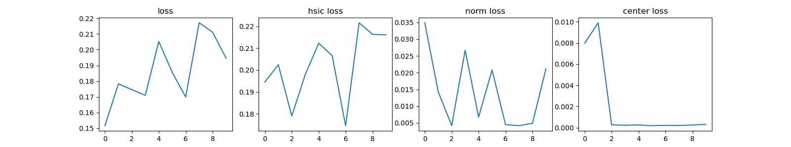
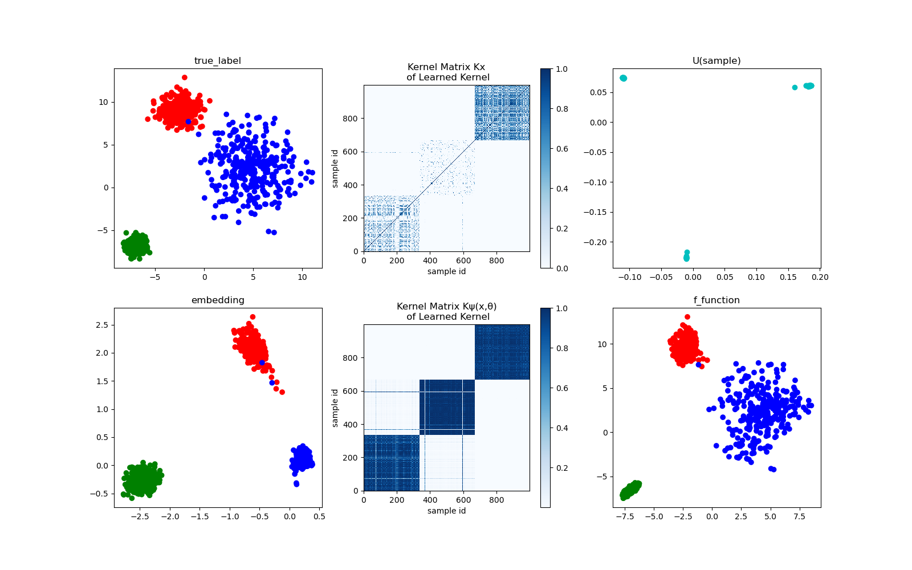
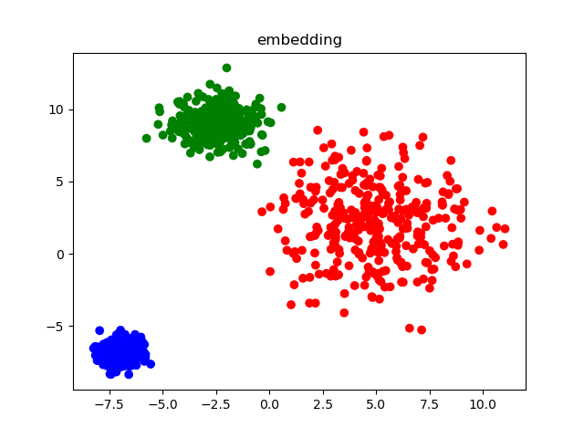

# data-mining final
# Deep Kernel Learning for Clustering
[Paper](https://epubs.siam.org/doi/10.1137/1.9781611976236.72)

# Requirements 
Python
- pytorch
- numpy
- tqdm
- seaborn
- sklearn
- matplotlib
- pandas

# Run
## Run
```
python main.py
```

## Hyperparameter
`py_code/config.py`

### Dataset
| Dataset type | Source |
| --- | --- |
| `moon` | sklearn.datasets |
| `circle` | sklearn.datasets |
| `blob` | sklearn.datasets |
| `aniso` | sklearn.datasets |
| `spiral` | py_code/spiral.py ([from](http://cs231n.github.io/neural-networks-case-study/))

## Output 
### file
- log.txt
- encoder model
### diagram
- Training loss


- Training result (embedding points)


- Clustering results using k-means
